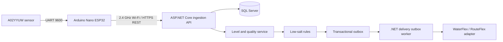

# Plan C: WaterFlex Arduino Nano ESP32 Salt Sensor

## Summary

Build the salt-monitoring sensor from documented, commercially available development hardware rather than
commissioning a white-label OEM product. The selected assembly uses an Arduino Nano ESP32, an official Arduino
Nano Screw Terminal Adapter, a genuine DFRobot A02YYUW ultrasonic sensor, a safety-listed external 5V supply,
and a Polycase WP-23 enclosure.

Culligan dealers install the assembly, provision it onto the customer's 2.4 GHz Wi-Fi, and associate its serial
number with an existing WaterFlex customer. Custom Arduino/ESP32 firmware reads raw distance, reports telemetry
directly to WaterFlex through a versioned HTTPS REST API, and supports calibration and OTA updates. The shared multi-tenant .NET
backend calculates fill percentage and creates one WaterFlex/RouteFlex delivery ticket after salt remains below
35%.

Plan C is suitable for engineering prototypes, dealer demonstrations, and a controlled field pilot. It can also
support limited production if assembly quality, compliance, cost, and field reliability are acceptable. For large
volumes, the carrier-board construction should be compared with the integrated OEM hardware in Plan A.

## Relationship to the other plans

- **Plan A:** integrated OEM/white-label hardware customized for WaterFlex. The OEM owns the production PCB,
  enclosure, factory, and certifications while WaterFlex controls data and firmware requirements.
- **Plan B:** prebuilt HojellyTek 03GW using Tuya Cloud and a Tuya Smart Life App SDK installer application.
- **Plan C:** WaterFlex assembles documented Arduino hardware and owns the complete firmware/data path.
- Plan C uses the REST ingestion contract defined here. Plans A and B may require source-specific integration,
  but share the same level-processing, ticketing, and WaterFlex domain logic after ingestion.

## Product boundaries

### In scope

- Arduino Nano ESP32 sensor assembly and small-batch build process.
- A02YYUW electrical integration, UART parsing, filtering, calibration, and physical mounting.
- Polycase WP-23 mechanical layout, cable entries, strain relief, and tank mounting.
- Wi-Fi provisioning, HTTPS REST telemetry, device identity, health reporting, and signed OTA firmware.
- Multi-tenant .NET backend and SQL Server persistence.
- Waterline-aware fill calculation, signal quality, stale-device detection, and low-salt rules.
- WaterFlex/RouteFlex delivery-ticket integration.
- Minimal React operations console for WaterFlex staff.
- Dealer installation, commissioning, troubleshooting, replacement, pilot, and rollout procedures.
- Finished-assembly compliance review and small-batch quality control.

### Out of scope

- Consumer application.
- New Culligan dealer portal.
- Subscription billing.
- Route optimization or driver workflow replacement.
- Duplication of WaterFlex customer, address, account, product, or routing master data.
- A custom production PCB in the initial Plan C pilot; that optimization belongs in Plan A or a later Plan C
  revision after the design is proven.

## Locked hardware decisions

| Component | Selected item | Purpose |
| --- | --- | --- |
| Controller | Arduino Nano ESP32 with male headers and USB-C | Wi-Fi/BLE, UART, firmware, TLS, OTA |
| Carrier | Arduino Nano Screw Terminal Adapter ASX00037 | Secure field wiring and Nano socket |
| Sensor | Genuine DFRobot A02YYUW, SKU SEN0311 | IP67 UART ultrasonic distance measurement |
| Enclosure | Polycase WP-23 | IP65/IP66 polycarbonate electronics enclosure |
| Power | Safety-listed regulated 5V USB supply, at least 1A | External mains isolation and Nano power |
| Cable | Quality USB-A-to-USB-C cable | Power to Nano USB-C |

### Confirmed A02YYUW characteristics

- Operating voltage: 3.3V to 5V.
- Average current: approximately 8 mA.
- UART: 9600 baud, 8 data bits, no parity, 1 stop bit.
- Range: 30 mm to 4,500 mm.
- Resolution: 1 mm.
- Stated accuracy: approximately +/- 10 mm.
- Blind zone: approximately 30 mm.
- Reference beam angle: approximately 60 degrees.
- IP67 integrated sensor body.
- Four-byte output frame: `0xFF`, distance high byte, distance low byte, checksum.
- With sensor RX floating or high, output is processed/steadier, normally every 100-300 ms.
- With sensor RX low, output is real-time, normally every 100 ms.

The 60-degree beam is a significant validation item in a narrow brine tank. The probe must be centered and
perpendicular to the surface, and wall/brine-well echoes must be tested before field approval.

## Target architecture



1. A02YYUW streams raw distance frames to an assigned Nano hardware UART.
2. Firmware validates checksums, rejects invalid samples, filters local noise, and records sensor health.
3. The Nano connects through customer Wi-Fi to the WaterFlex HTTPS API using TLS and a unique device token.
4. The API validates schema and identity, deduplicates readings, resolves the active installation/calibration,
  and creates normalized readings.
5. SQL Server stores device mapping, calibration, raw readings, calculated fill, health, rules state, tickets,
   outbox, and audit events.
6. The level service calculates fill percentage from the installation's tank depth and each sensor-to-surface reading.
7. The rules service creates an idempotent delivery command only after a sustained below-35% condition.
8. `IDeliveryTicketGateway` creates the delivery in WaterFlex/RouteFlex when endpoints become available.

## Deliverables

### 1. Complete prototype bill of materials

Required:

- Arduino Nano ESP32 with headers.
- Arduino Nano Screw Terminal Adapter ASX00037.
- Genuine DFRobot A02YYUW SEN0311 with PH2.0 four-pin cable/pigtail.
- Polycase WP-23 enclosure, gasketed cover, and cover screws.
- Safety-listed regulated 5V USB wall adapter rated for at least 1A.
- Quality USB-A-to-USB-C cable, preferably no longer than 1.5 m with suitable power conductors.
- Nonconductive internal mounting plate/cradle or standoffs compatible with the carrier and WP-23 bosses.
- Separate strain-relieved cable entry for the sensor lead.
- A sealed way to route USB power: a suitable panel-mount USB-C feedthrough or a split cable gland sized for
  the molded cable. Do not drill a normal small gland and force a USB-C connector through it.
- Tank-lid mounting bracket or approved mechanical attachment.
- Wire ferrules, heat-shrink, labels, and assembly hardware as needed.

Not required in the baseline prototype:

- External status LED or 330-ohm resistor; use onboard diagnostics during development.
- Magnetic reed switch; use automatic first-boot/recovery provisioning unless pilot testing proves a physical
  sealed control is needed.
- Additional bulk capacitor; add one only if power testing demonstrates brownouts or UART corruption.
- UART level shifter for a genuine DFRobot SEN0311 powered from 3.3V. Revalidate clones or substitutions.

### 2. Electrical assembly and wiring package

The Nano plugs directly into the carrier. The carrier is passive and exposes each Nano pin at a labeled screw
terminal. No wires are required between the Nano and carrier.

Recommended A02YYUW connection:

| A02YYUW signal | ASX00037 terminal / Nano pin | Notes |
| --- | --- | --- |
| `VCC` | `3V3` | Power genuine SEN0311 from 3.3V |
| `GND` | Any `GND` | Common reference |
| `TX` | `D4` | Sensor output to Nano `Serial1` RX |
| `RX` | Leave disconnected and insulated | Floating selects processed/stable output |

Important rules:

- Connect sensor TX to Nano RX; never TX to TX.
- Do not rely on cable colors. Confirm VCC, GND, TX, and RX from the sensor label/documentation.
- Insulate the unused RX conductor with heat-shrink so it cannot contact another terminal.
- Use the supplied PH2.0 pigtail or a matching breakout/pigtail and terminate conductors securely in the screw
  terminals. Do not leave loose Dupont jumpers in a field assembly.
- Do not apply more than 3.3V to Nano GPIO.
- Power the Nano through USB-C. Do not simultaneously power USB-C and VIN/3V3.
- Use `Serial` for native USB diagnostics and `Serial1` for the sensor, avoiding the boot/crash UART.

Firmware UART initialization:

```cpp
constexpr int SENSOR_RX_PIN = D4;
constexpr int SENSOR_TX_PIN = D5; // Assigned to Serial1 but not physically connected.

void setup() {
  Serial.begin(115200);
  Serial1.begin(9600, SERIAL_8N1, SENSOR_RX_PIN, SENSOR_TX_PIN);
}
```

### 3. Power package

Recommended prototype supply:

- Phihong `PSAA05A-050QL6-R`, or an equivalent reputable cULus/UL/ETL-listed, regulated 5V USB adapter rated
  for at least 1A.
- A 5V/2A adapter is also safe; the device draws only what it needs.
- Keep mains conversion outside the WP-23 enclosure.
- Avoid unbranded wall adapters and thin promotional cables.
- Do not connect a 9V or 12V source to the Nano USB-C port.

Power path:

```text
Wall outlet -> listed 5V adapter -> USB cable -> Nano USB-C -> Nano 3V3 -> A02YYUW
```

Power validation must include Wi-Fi association/transmit peaks, HTTPS reconnect bursts, repeated power cycles,
low/high AC line where laboratory equipment permits, and the longest approved USB cable.

### 4. Polycase WP-23 mechanical package

Verified enclosure dimensions:

- Internal: 106 x 81 x 49 mm.
- External: 115 x 90 x 55 mm.
- Polycarbonate, gasketed, IP65/IP66 family, non-metallic and suitable for Wi-Fi.

Layout requirements:

- Mount the Nano/carrier flat on a nonconductive mounting plate, cradle, or verified standoffs.
- Keep the Nano antenna end at least 10-15 mm from wire bundles, metal fasteners, and enclosure walls.
- Orient USB-C toward a side wall and reserve 15-20 mm for the connector, bend radius, and strain relief.
- Use separate sealed entries for USB power and the A02YYUW cable.
- Mount the electronics enclosure outside the brine vapor space wherever possible.
- The A02YYUW sensing face remains exposed and points downward into the tank; it cannot measure through the
  WP-23 wall or lid.
- Center the probe over the usable salt area and keep its 60-degree beam clear of tank walls, brine well,
  safety float, and cables.
- Do not claim the original ingress rating after machining until the complete modified assembly is inspected or
  tested with the selected glands/feedthroughs.
- Use Polycase CAD and the Arduino carrier CAD plus the real parts to produce a drilling and mounting drawing.
- Complete a physical fit check before drilling or ordering multiple enclosures: terminal access, lid clearance,
  USB routing, sensor cable routing, antenna clearance, and tank bracket.

The WP-23 lid is not assumed to expose the onboard RGB LED. Visual status is optional; use USB serial and the
provisioning/commissioning interface unless pilot testing proves an external indicator or light pipe is needed.

### 5. Mechanical tank-mounting package

- Survey representative Culligan brine tanks and document lid dimensions, thickness, curvature, obstructions,
  hinge behavior, fill opening, and normal salt/water heights.
- Design a bracket or drilling template that keeps the A02YYUW perpendicular and near the center of the salt
  surface without interfering with refilling or service.
- Define whether the WP-23 mounts to the lid, tank side, nearby wall, or a bracket. Prefer an arrangement that
  minimizes vibration and keeps electronics out of concentrated brine vapor.
- Provide strain relief so opening the lid cannot pull sensor or power conductors.
- Make the sensor replaceable without replacing the entire enclosure when practical.
- Produce installation drawings for every approved tank family; do not ask installers to improvise location.

### 6. Arduino firmware

#### Sensor acquisition

- Read 4-byte UART frames at 9600 baud.
- Search for header `0xFF` and read high byte, low byte, and checksum.
- Validate `checksum == (0xFF + highByte + lowByte) & 0xFF`.
- Calculate distance in millimeters as `(highByte << 8) | lowByte`.
- Reject invalid checksum, timeout, zero/out-of-range data, and implausible rate-of-change.
- Collect multiple readings and calculate median/quality metrics.
- Keep the sensor RX input floating for processed mode unless testing shows real-time mode is better.

#### Provisioning and configuration

- On first boot or after factory reset, start a time-limited SoftAP captive portal.
- Protect provisioning with a unique per-device password or QR code; do not leave an open setup network.
- Accept only 2.4 GHz Wi-Fi credentials and clearly report connection success/failure.
- Store configuration in ESP32 NVS with schema version, CRC/validation, and safe defaults.
- If saved Wi-Fi remains unavailable for a configured recovery period, expose a secure recovery provisioning
  flow. This removes the baseline need for a sealed external button.
- Provide an authenticated factory reset/reprovision method. Add a physical sealed control only if recovery
  testing proves software-only recovery inadequate.

#### Calibration

- Technicians enter `tankDepthCm` from the sensor face to the inside bottom of the tank.
- The provisioning UI captures `currentDistanceCm` directly from the Nano's live sensor stream; technicians do
  not transcribe or manually override the reading.
- Capture multiple valid samples, use a median result, and reject unstable or out-of-range commissioning reads.
- The API accepts 0.1 cm precision and converts both values to integer millimeters for persistence and sensor math.
- Validate that the current sensor distance is within the sensor range and no greater than tank depth.
- Store tank depth, commissioning reading, calculated initial fill, calibration version, timestamp, installer,
  and tank profile.
- Permit approved tank profiles only after physical validation; otherwise calibrate each installation.

#### Telemetry and security

- Connect to WaterFlex using HTTPS on the approved public endpoint with normal server-certificate validation.
- Give each sensor a unique device ID and unique revocable bearer token stored in encrypted NVS.
- POST bounded batches containing raw distance, locally filtered distance, sample count, quality, source timestamp, uptime, reset reason,
  firmware version, Wi-Fi RSSI, calibration version, and error flags.
- Use a random boot ID plus monotonic sequence number for backend deduplication.
- Remove queued items only after an accepted or duplicate per-reading acknowledgement.
- Reconnect with exponential backoff and jitter; avoid synchronized fleet reconnect storms.
- Persist a bounded queue of readings during outages and preserve source timestamps across resets.
- Implement signed OTA images, version checks, staged rollout, rollback, and interrupted-update recovery.
- Enable watchdog/brownout diagnostics and report reset causes.
- Do not embed shared fleet-wide secrets in source or firmware images.

#### Reporting cadence

- A02YYUW streams several readings per second, but WaterFlex does not need every frame.
- Sample locally over a short window and report approximately hourly by default, plus commissioning, recovery,
  calibration, significant change, and health/error events.
- Avoid or flag readings during the customer's normal regeneration window.
- Make reporting and local sampling intervals remotely configurable within safe limits.

### 7. Dealer installation and commissioning flow

1. Dealer selects the WaterFlex customer and starts sensor installation.
2. Dealer records or scans the unique Nano assembly serial/QR code.
3. Dealer confirms the tank is an approved model or follows the model-specific mounting template.
4. Dealer mounts the A02YYUW centered and perpendicular, clear of the tank wall and brine hardware.
5. Dealer mounts the WP-23 and verifies cable strain relief and normal lid movement.
6. Dealer connects the listed 5V adapter and powers the Nano through USB-C.
7. On first boot, dealer joins the sensor's secured temporary setup network and enters 2.4 GHz Wi-Fi details.
8. Dealer records usable tank depth; the provisioning UI captures the current sensor-to-surface reading directly
  from the connected Nano, or applies an approved tank profile.
9. Sensor connects to the WaterFlex HTTPS API and sends its first authenticated telemetry batch.
10. WaterFlex verifies device identity, customer mapping, calibration, first reading, signal quality, and health.
11. Dealer closes/seals the enclosure and records installation photos where policy permits.
12. Dealer receives a commissioning success result. The homeowner requires no application.

Replacement flow must revoke the old device, preserve customer/ticket history, pair the replacement, validate
calibration, and prevent both devices from triggering tickets.

### 8. Shared WaterFlex backend

- .NET solution separated into API, Domain, Ingestion, Rules, Infrastructure, and Worker components.
- ASP.NET Core device API with TLS, per-device bearer-token authentication, schema validation, request limits,
  deduplication, replay protection, rate limiting, metrics, and audit.
- SQL Server schema for Dealer/Tenant, Device, DeviceCustomerMapping, Calibration, SensorReading,
  TriggerState, DeliveryTicket, OutboxEvent, DeviceHealth, FirmwareDeployment, and AuditEvent.
- Enforced tenant scope on every operation.
- Device lifecycle: manufactured/assembled, claimed, commissioning, active, stale, offline, replaced, revoked,
  retired, and destroyed.
- Credential lifecycle: issue, provision, rotate, revoke, and recover without sharing credentials between units.
- REST/internal APIs needed by existing WaterFlex screens, commissioning flow, and operations console.

### 9. Fill percentage and signal quality

Use:

`fillPct = clamp((tankDepth - measuredDistance) / tankDepth * 100, 0, 100)`

Rules:

- `tankDepth` and every sensor reading use the sensor face as the same zero point.
- A measured distance equal to tank depth is 0%; a surface at the sensor face is 100%.
- Smooth with a median/robust window and require a minimum valid sample count.
- Reject measurements inside the blind zone, outside calibration bounds beyond tolerance, or changing at an
  implausible rate.
- Flag persistent waterline, unstable echo, suspected wall echo, salt coning/bridging, stale data, weak Wi-Fi,
  bad calibration, and regeneration-window readings.
- Preserve raw frames/readings, normalized values, calibration version, and calculation version for audit and
  reprocessing.
- Confirm during testing that 35% lies above the normal waterline for every approved tank profile.

### 10. Delivery-ticket automation

- Trigger only after fill remains below 35% for the configured sample/time window.
- Require an active device, valid customer mapping, recent reading, valid calibration, and acceptable confidence.
- Suppress creation when an open delivery ticket exists or the customer is in post-delivery cooldown.
- Generate an idempotency key from tenant, customer/device, and depletion cycle.
- Write the request transactionally to an outbox; retry transient errors and dead-letter permanent failures.
- `IDeliveryTicketGateway` request includes WaterFlex customer/account reference, device, fill percentage,
  threshold, reading timestamp, salt product/quantity if known, and idempotency key.
- Use a stub until WaterFlex endpoints and sandbox credentials are supplied.
- Synchronize fulfilled/cancelled status when supported and reset the depletion cycle without allowing duplicate
  orders.

### 11. WaterFlex internal operations console

- WaterFlex staff authentication and role-based authorization.
- Fleet by dealer: commissioning, active, stale, offline, unmapped, revoked, and failed.
- Latest raw/filtered distance, calculated fill, calibration, Wi-Fi RSSI, firmware, reset reason, and health.
- Provisioning/commissioning failures, customer mapping, replacement, credential revocation, and retirement.
- Reading/calculation history sufficient to diagnose false alarms and wall/waterline behavior.
- Ticket/outbox failures and controlled retry.
- Firmware campaign creation, staged rollout, pause, failure, rollback, and completion status.
- Tenant-aware support access and immutable audit history.

### 12. Documentation and small-batch build package

- Controlled BOM with manufacturer part numbers and approved substitutes.
- Wiring diagram, carrier orientation photo, terminal torque guidance from the carrier documentation, cable
  labels, and enclosure layout drawing.
- WP-23 machining drawing and inspection checklist.
- Firmware build, signing, programming, serialization, credential-injection, and test instructions.
- Assembly traveler and end-of-line test record for every serialized unit.
- Dealer quick-start, installation checklist, calibration instructions, troubleshooting guide, replacement guide,
  and WaterFlex support runbook.
- RMA, secure decommissioning, credential revocation, and disposal procedure.

## Step-by-step implementation process

### Phase C0: Freeze requirements and procure parts

1. Identify representative tank families, salt types, standing-water levels, and installation environments.
2. Define measurable acceptance thresholds for accuracy, false/missed delivery events, Wi-Fi, installation time,
   temperature/humidity, and serviceability.
3. Purchase at least 3-5 complete sets of the locked hardware from traceable suppliers.
4. Download and archive Nano, ASX00037, A02YYUW, and WP-23 datasheets/CAD and record exact revisions.
5. Assign prototype serial numbers and establish an engineering build log.

**Exit gate:** all parts and documentation are available and no unresolved voltage, connector, mechanical, or
supply mismatch blocks assembly.

### Phase C1: Electrical bench bring-up

1. Seat the Nano on ASX00037 in the correct orientation with USB-C accessible.
2. With power disconnected, connect A02YYUW VCC to 3V3, GND to GND, TX to D4, and insulate RX.
3. Inspect continuity and shorts before applying power.
4. Power through a reputable 5V USB supply with current monitoring during initial bring-up where possible.
5. Load a minimal `Serial1` UART reader and validate frame header, checksum, and millimeter conversion.
6. Compare readings against measured distances across 30 mm to representative tank depth.
7. Test USB serial diagnostics, repeated reset, unplug/replug, and Wi-Fi association while reading the sensor.
8. Record current, reset behavior, invalid frame rate, and measurement repeatability.

**Exit gate:** all prototypes read valid A02YYUW frames without GPIO overvoltage, unexplained resets, or unsafe
heating, and match reference distances within the approved preliminary tolerance.

### Phase C2: Firmware foundation

1. Create firmware repository, reproducible build, formatting/linting, unit-test, signing, and release pipeline.
2. Implement robust UART state machine and sample-quality metrics.
3. Implement first-boot/recovery SoftAP provisioning and secure configuration storage.
4. Implement tank-depth calibration, commissioning surface capture, and local filtering.
5. Implement device identity, HTTPS REST telemetry, schema, retries, and bounded persistent outage buffering.
6. Implement watchdog/reset diagnostics and secure OTA with rollback.
7. Add automated host tests for parser/checksum/calibration and hardware-in-the-loop tests for the real board.
8. Define firmware versioning and backward-compatible configuration migration.

**Exit gate:** a bench device can be provisioned, calibrated, disconnected/reconnected, and updated safely while
continuing to publish valid normalized telemetry.

### Phase C3: Shared backend foundation (parallel with C2)

1. Create .NET API, Domain, Ingestion, Rules, Infrastructure, and Worker projects.
2. Implement the development HTTPS API and unique hashed per-device bearer credentials.
3. Define the versioned Plan C REST telemetry batch and acknowledgement schemas.
4. Implement tenant isolation, SQL schema, device/customer mapping, readings, calibration, health, trigger state,
   tickets, outbox, firmware deployment, and audit.
5. Define `IDeliveryTicketGateway` and implement a deterministic stub.
6. Add observability, dead-letter handling, secret management, and local/integration test environments.

**Exit gate:** recorded and live REST telemetry is authenticated, attributed to the server-resolved installation, and available
to the level/rules pipeline.

### Phase C4: Tank and environmental validation

1. Build a controlled tank test fixture with known sensor-to-surface distances.
2. Test approved tank geometries at full, approximately 35%, waterline, and effectively empty.
3. Test pellets and crystals, centered and coned salt, salt bridging, thin water cover, and submerged low salt.
4. Test probe center/offset, tilt, wall/brine-well interference, lid movement, and mounting variation.
5. Test before, during, and after regeneration, including foam and changing water level.
6. Run multi-day humidity/condensation and salt-vapor exposure with the WP-23 outside the tank and probe inside.
7. Test weak Wi-Fi, router restart/replacement, DHCP changes, internet loss, ingestion API outage, server outage, and
   power cycles.
8. Tune filtering, confidence flags, reporting cadence, calibration procedure, and mounting templates.

**Exit gate:** each approved tank profile meets the agreed false/missed event and repeatability limits, and the
60-degree A02YYUW beam does not create unresolved wall-echo behavior.

### Phase C5: WP-23 pilot assembly

1. Create a CAD-backed internal layout for carrier, antenna clearance, USB path, sensor path, and mounting.
2. Select and test a sealed USB feedthrough/split gland and sensor cable gland.
3. Build one enclosure before machining the remaining pilot batch.
4. Verify lid clearance, terminal access, USB bend radius, strain relief, antenna RSSI, and tank mounting.
5. Inspect modified enclosure sealing and run splash/condensation tests appropriate to the intended rating.
6. Produce final machining drawing, assembly traveler, photos, labels, and end-of-line test fixture.
7. Assemble 3-5 engineering validation units using controlled parts and serialized records.

**Exit gate:** enclosed units pass electrical, RF, sensor, provisioning, calibration, cable-pull, and enclosure
inspection without requiring loose wiring or installer access to live conductors.

### Phase C6: Level processing and ticket automation

1. Implement tank-depth percentage calculation and versioned calibration.
2. Implement smoothing, quality/confidence, regeneration filtering, and stale/offline detection.
3. Implement sustained below-35% evaluation, open-ticket suppression, cooldown, and idempotency.
4. Process ticket commands through the transactional outbox and WaterFlex stub.
5. Prove a physical low-tank sequence creates exactly one stub ticket despite duplicate or delayed telemetry.
6. Complete internal operations views for devices, readings, mappings, firmware, and ticket failures.

### Phase C7: WaterFlex integration and dealer pilot

1. Replace the ticket stub when WaterFlex endpoints and sandbox credentials arrive.
2. Connect customer lookup/device mapping to existing WaterFlex workflows.
3. Expose approved level and health fields through existing WaterFlex interfaces.
4. Select one Culligan dealer and 10-20 representative customers.
5. Train installers and observe initial installs using the controlled checklist.
6. Measure installation time, provisioning success, calibration errors, RSSI/offline rate, false/missed events,
   ticket precision, firmware-update success, enclosure issues, support contacts, and replacements.
7. Run at least one controlled low-salt event for each representative tank family.
8. Fix critical issues and repeat acceptance tests.

### Phase C8: Production decision and rollout

1. Calculate complete landed unit cost, assembly labor, test labor, warranty reserve, support cost, and inventory
   requirements.
2. Review end-product compliance; Nano board certifications do not automatically certify the modified WP-23
   assembly, cables, power supply, or complete product.
3. Compare Plan C pilot metrics and cost with Plan A OEM quotations and Plan B Tuya results.
4. Approve one of these outcomes:
   - continue Plan C for limited or broader production with a controlled assembly line;
   - use Plan C only as the reference/pilot platform and migrate volume to Plan A;
   - stop Plan C if beam geometry, cost, compliance, or field reliability is unacceptable.
5. If continuing, roll out by dealer cohort with firmware staging, inventory traceability, replacement stock,
   quality monitoring, and rollback capability.

## Verification plan

### Firmware/unit tests

- UART header synchronization, partial frames, timeout, checksum, noise, and recovery.
- Distance conversion, range checks, median/filtering, confidence, and rate-of-change checks.
- Configuration validation/migration, first boot, recovery provisioning, calibration, and factory reset.
- REST payload/acknowledgement schema, boot/sequence IDs, retry/backoff, persistent buffering, TLS failure, and credential rejection.
- OTA signature, interrupted download, failed boot, rollback, and version policy.

### Backend tests

- Telemetry normalization and tenant mapping.
- Fill math, clamping, tank-depth calibration, smoothing, regeneration suppression, and stale state.
- Threshold/debounce, duplicate suppression, open-ticket check, cooldown, and idempotency.
- Transactional outbox retry/dead-letter behavior and WaterFlex contract tests.
- Cross-tenant authorization attempts, revoked device, replayed message, malformed payload, and secret rotation.
- Load test at 2,000 devices plus reconnect and OTA/reporting bursts.

### Electrical/mechanical tests

- Correct carrier orientation, terminal retention, strain relief, and no exposed conductors.
- 3.3V sensor supply, Wi-Fi current peaks, longest approved USB cable, and repeated power cycles.
- WP-23 fit, lid clearance, cable entry, pull test, bracket, lid movement, and modified-enclosure ingress checks.
- Antenna clearance and RSSI with enclosure open/closed and in representative basements.
- Temperature, humidity, condensation, salt vapor, probe fouling, and corrosion inspection.

### Measurement tests

- Multiple units and production lots where available.
- Approved tanks, lids, salt types, fill levels, waterlines, and mounting tolerances.
- Flat, coned, bridged, wet, submerged, foamy, turbulent, and regeneration conditions.
- Comparison against manual reference measurements over time.
- False-low, false-high, missed-low, and time-to-trigger metrics.

## Success criteria

- Dealer installation requires no homeowner application and fits the approved on-site time target.
- Enclosed assemblies provision reliably and maintain acceptable Wi-Fi in representative locations.
- A02YYUW readings meet the approved accuracy/repeatability and false/missed event limits on every supported
  tank family.
- Tank-depth calibration and sustained-threshold filtering produce a consistent 35% trigger across readings.
- Each device has unique revocable credentials and supports safe signed OTA with rollback.
- A sustained low condition creates one and only one WaterFlex delivery ticket.
- Tenant boundaries prevent one dealer from accessing another dealer's devices or customers.
- The WP-23 assembly, listed power supply, build records, support model, and compliance path are approved before
  production expansion.
- Complete unit economics are acceptable or there is an approved migration to Plan A.

## Primary risks and mitigations

- **Wide 60-degree ultrasonic beam:** center and align the probe, validate each tank profile, use confidence
  detection, and reject unsupported geometries.
- **Salt/water ambiguity:** treat the ultrasonic return as the current visible surface, filter regeneration
  periods, and validate tank-specific thresholds where salt can become submerged.
- **Development-board/carrier reliability:** use official boards, screw terminals/ferrules, mechanical retention,
  strain relief, serialized end-of-line testing, and migrate to integrated Plan A hardware for volume if needed.
- **WP-23 space/cable routing:** perform a complete fit build before machining the batch and use CAD-backed
  drawings.
- **Modified enclosure ingress:** select rated entries, inspect/test the assembled unit, and avoid claiming the
  untouched enclosure rating without evidence.
- **Basement Wi-Fi:** maintain antenna clearance, monitor RSSI, guide placement, implement resilient reconnect,
  and mark locations with insufficient coverage unsupported or requiring remediation.
- **Software-only recovery:** provide secure automatic recovery provisioning; add a sealed physical control only
  if field testing shows it is necessary.
- **Board and total unit cost:** quote full landed cost and compare against Plan A before national scale.
- **Certification:** treat Nano certifications as component evidence, not final-product approval; review the
  complete assembly and changes.
- **Security:** use per-device identity, TLS, signed OTA, credential rotation/revocation, tenant isolation, audit,
  staged updates, and no fleet-wide embedded secret.

## Deferred inputs

- WaterFlex authentication, customer lookup, device mapping, delivery creation, and ticket-status endpoints.
- Final approved tank families and installation geometry.
- Agreed numerical pilot acceptance thresholds for measurement, availability, installation time, and support.
- Final WP-23 USB/sensor cable entry parts and tank bracket after physical fit testing.
- Production volume, warranty target, field-failure target, and acceptable complete unit cost.
- Final compliance laboratory/consultant determination for the assembled product.
